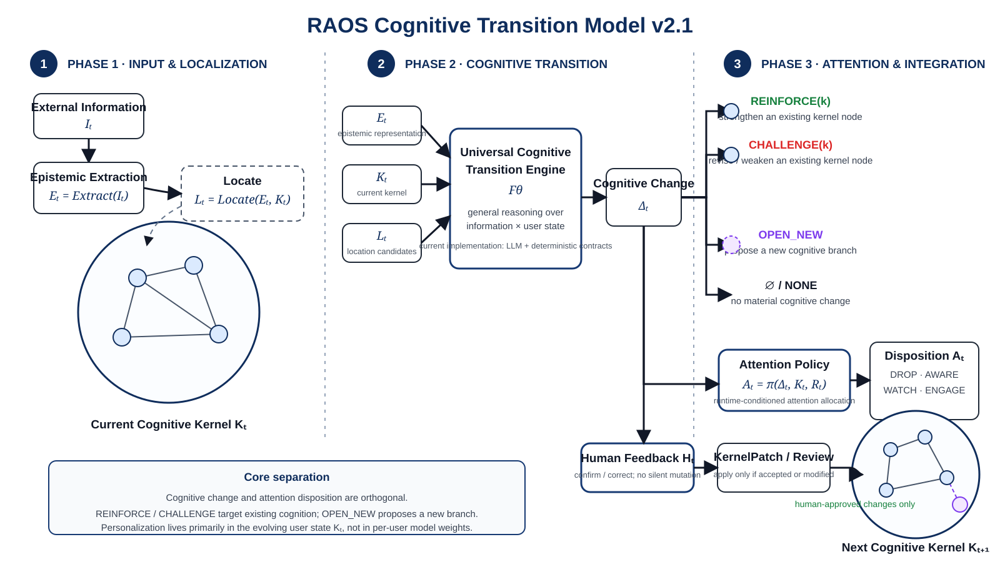

# Research Attention OS — Cognitive Transition Model v2.1

Version: RAOS Cognitive Transition Model v2.1  
Status: **FROZEN BASELINE**  
Date: 2026-09-04  
Scope: Cognitive-transition semantics, progressive alignment, and evaluation philosophy

> This document is the canonical baseline for how RAOS interprets new information relative to a user's current cognition. If earlier design notes use inconsistent symbols or older transition semantics, this document takes precedence for the cognitive-transition layer.



*Figure 1. New information is interpreted relative to the current Cognitive Kernel; cognitive change and attention disposition are separate; only human-approved changes enter the next Kernel state.*

---

## 1. Motivation

Research Attention OS exists because the volume of potentially relevant information now exceeds what a researcher can read, understand, verify, and absorb manually.

The central problem is therefore not merely retrieval. It is cognitive allocation:

> Given new information and the researcher's current state of understanding, what could this information change, and how much human attention should be spent on it now?

RAOS is not a recommender system that learns a fixed preference profile. It maintains an explicit, evolving representation of the user's current research cognition and estimates how external information could change that state.

The long-term product objective remains:

```text
Massive Information
        ↓
Minimal Human Attention
        ↓
Maximum Useful Cognitive Progress
```

Directional product metric:

```text
CROA = Useful Cognitive Change / Human Attention Cost
```

CROA is a product objective, not a claim that all cognitive value can be reduced to one perfectly measurable scalar.

---

## 2. Core design principle

The central design choice in v2.1 is:

> **Personalization lives primarily in user state, not in per-user model weights.**

In shorthand:

$$
\text{Personalization} \approx K_t
$$

where $K_t$ is the user's current Cognitive Kernel.

The transition engine should be as general as possible:

$$
\text{Universal Engine } F_\theta + \text{User State } K_t
$$

The same reasoning engine may serve different users because different users provide different Cognitive Kernels.

RAOS therefore does **not** assume that it understands a user at cold start.

> **Alignment is progressive, not assumed.**

A sparse initial Kernel becomes more accurate through real usage, explicit correction, reviewed KernelPatch proposals, and committed state evolution.

---

## 3. Cognitive Kernel

The Cognitive Kernel is the explicit, reviewable, committed projection of the user's current research cognition.

It may contain:

```text
INTENT
  Goal
  Project
  Bottleneck

EPISTEMIC
  Question
  Belief
  Hypothesis
  Model

EXECUTION
  Decision
  Experiment
```

The Kernel is intentionally small and high-density. It is not a transcript, note archive, recommendation profile, document collection, or hidden user embedding.

A useful theoretical statement is:

$$
K_t \approx \text{explicit committed projection of the user's broader cognition}
$$

RAOS may conceptually acknowledge an unobservable full cognitive state, but engineering logic must operate on $K_t$, because the system cannot directly observe the user's complete mind.

For v2.1, **$K_t$ is the canonical engineering symbol for current user cognition**. Earlier uses of $C_t$ should not be used in the implementation contract unless a later theoretical document explicitly reintroduces it.

---

## 4. Canonical symbols

| Symbol | Name | Meaning |
|---|---|---|
| $I_t$ | Information | External information arriving at time $t$ |
| $E_t$ | Epistemic Representation | Claims, Observations, Inferences, and Evidence extracted from $I_t$ |
| $K_t$ | Cognitive Kernel | User's explicit committed cognitive state at time $t$ |
| $L_t$ | Location Candidates | Kernel regions/nodes that may be relevant to $E_t$ |
| $\Delta_t$ | Potential Cognitive Change | System-estimated cognitive effect of absorbing the information |
| $R_t$ | Runtime Context | Current task, available attention, timing, interruption state, etc. |
| $A_t$ | Attention Action / Disposition | DROP, AWARE, WATCH, or ENGAGE |
| $H_t$ | Human Feedback | Human confirmation, correction, acceptance, modification, or rejection |
| $K_{t+1}$ | Next Cognitive Kernel | Next committed Kernel state after reviewed changes |
| $F_\theta$ | Cognitive Transition Engine | General engine estimating $\Delta_t$ from information and user state |
| $\pi$ | Attention Policy | Policy mapping cognitive change and runtime context to $A_t$ |

Important distinction:

> $\Delta_t$ is a **predicted potential cognitive change**, not an automatic committed Kernel mutation.

Committed Kernel mutation occurs only through human-reviewed KernelPatch acceptance or modification.

---

## 5. Natural-language model

When new information arrives, RAOS does not begin by asking whether the document is "good" or "relevant" in the abstract.

First, RAOS asks what the information actually says. It separates attributed Claims, direct Observations, system Inferences, and Evidence relations. This produces an epistemic representation rather than treating the document as one undifferentiated object.

Second, RAOS compares that representation with the user's current Cognitive Kernel. It performs a broad localization step: which parts of the user's current research state might this information matter to? This step should prefer recall over precision. Location is only a candidate relation, not yet a cognitive update.

Third, the Cognitive Transition Engine asks the central question:

> If this information were correctly absorbed, what would change in the user's current cognition?

The answer may be:

- strengthen an existing branch (`REINFORCE`);
- modify, weaken, restrict, or overturn an existing branch (`CHALLENGE`);
- create a meaningful new branch because no existing Kernel node is the correct landing point (`OPEN_NEW`);
- or make no material cognitive change (`NONE`).

Fourth, RAOS allocates attention separately. A cognitively meaningful update does not mechanically imply immediate deep engagement, and strong topical relevance does not mechanically imply cognitive change. Runtime context matters.

Finally, the user retains cognitive authority. RAOS may propose a cognitive update or a KernelPatch, but only human-approved changes enter the next committed Kernel state.

Over repeated use, the system becomes more aligned with the user primarily because $K_t$ becomes a richer and more accurate representation of the user's evolving cognition—not because the base LLM silently becomes a personalized copy of the user.

---

## 6. Mathematical formalization

### 6.1 Epistemic extraction

$$
E_t = \operatorname{Extract}(I_t)
$$

where:

$$
E_t = \{\text{Claims, Observations, Inferences, Evidence}\}
$$

### 6.2 Localization

$$
L_t = \operatorname{Locate}(E_t, K_t)
$$

with:

$$
L_t \subseteq K_t
$$

Localization is deliberately not the same as cognitive update:

$$
\boxed{L_t \neq \Delta_t}
$$

### 6.3 Cognitive transition

$$
\boxed{\Delta_t = F_\theta(E_t, K_t, L_t)}
$$

with:

$$
\Delta_t \in
\left\{
\varnothing,
\operatorname{REINFORCE}(k),
\operatorname{CHALLENGE}(k),
\operatorname{OPEN\_NEW}
\right\}
$$

where $k$ is an existing eligible Kernel node.

### 6.4 Attention allocation

$$
\boxed{A_t = \pi(\Delta_t, K_t, R_t)}
$$

where:

$$
A_t \in \{\text{DROP, AWARE, WATCH, ENGAGE}\}
$$

### 6.5 Human authority and Kernel evolution

Human Feedback does not itself imply automatic Kernel mutation.

If no reviewed KernelPatch is accepted or modified:

$$
K_{t+1} = K_t
$$

If a reviewed KernelPatch is accepted or modified:

$$
K_{t+1} = \operatorname{ApplyAcceptedPatch}(K_t)
$$

The operational loop is:

$$
I_t \rightarrow E_t \rightarrow L_t \rightarrow \Delta_t \rightarrow A_t \rightarrow H_t
$$

with committed Kernel evolution gated separately by human review:

$$
K_t \xrightarrow{\text{accepted KernelPatch}} K_{t+1}
$$

---

## 7. Cognitive change semantics

Cognitive change and attention disposition are orthogonal dimensions.

### REINFORCE

`REINFORCE(k)` means the existing cognition remains fundamentally valid and becomes stronger, richer, better supported, or more precisely grounded.

Requirements:

- target $k$ already exists in the current Kernel;
- target is update-eligible cognition, not merely a broad topical location;
- source information affects the target proposition at compatible scope.

### CHALLENGE

`CHALLENGE(k)` means the existing cognition must be modified, weakened, restricted, or overturned.

Requirements:

- target $k$ already exists in the current Kernel;
- evidence addresses the target proposition itself;
- success of an alternative method is not automatically a challenge to the current proposition;
- scope alignment is required.

`CHALLENGE` is therefore an **inside-Kernel** operation, just like `REINFORCE`.

### OPEN_NEW

`OPEN_NEW` means no existing Kernel node is the correct landing point, but the information creates a meaningful new cognitive branch worth retaining.

Requirements:

- no existing target adequately captures the cognitive change;
- the branch is materially useful, not merely topical novelty;
- `OPEN_NEW` must not be used as fallback because a `REINFORCE` or `CHALLENGE` attempt failed.

`OPEN_NEW` proposes a branch outside the current Kernel. It becomes part of $K_{t+1}$ only after human-approved admission.

### NONE

`NONE` / $\varnothing$ means the information may be readable, topical, interesting, or worth awareness, but it does not materially change the current Cognitive Kernel.

This is a valid and important outcome.

---

## 8. Location is not Update Target

RAOS must preserve:

$$
\boxed{\text{Location} \neq \text{Update Target}}
$$

A Goal or Project may tell the system where information matters without being the proposition that is strengthened or challenged.

Example:

```text
Source: a new reactive humanoid-control paper

Location:
  Project: Motor Intelligence

Possible Update Target:
  Model: temporal motor intelligence can be partially separated from high-level cognition
```

The Project is the cognitive neighborhood. The Model is the cognition that may actually change.

---

## 9. Attention semantics

Attention disposition answers a different question from cognitive change:

> Given the predicted cognitive effect, the current Kernel, and runtime context, what should the human do now?

```text
DROP   — do not spend further human attention now
AWARE  — know it exists; quick awareness is sufficient
WATCH  — not worth deep work now, but RAOS assumes future monitoring responsibility
ENGAGE — invest serious attention now
```

Legal combinations include:

```text
OPEN_NEW + WATCH
REINFORCE + ENGAGE
REINFORCE + AWARE
NONE + AWARE
NONE + DROP
```

Therefore:

$$
\boxed{\text{Cognitive Change} \neq \text{Attention Action}}
$$

---

## 10. What the LLM actually knows about the user

The base LLM does not inherently know the user's private research cognition.

At the Impact stage, the model receives a structured representation containing:

```text
Epistemic Objects
  Claims
  Observations
  Inferences
  Evidence

Current Kernel Context
  candidate locations
  eligible cognitive targets
  target id / type / title
  target proposition
  target scope
  relevant target importance/priority context
```

The model therefore reasons from:

$$
\text{generic reasoning ability}
+
\text{RAOS transition semantics}
+
\text{explicit user state } K_t
$$

This is contextual alignment, not per-user model training.

DeepSeek is a current implementation choice, not part of the Cognitive Kernel and not a permanent architectural dependency.

---

## 11. Cold start and progressive alignment

RAOS must not assume a complete user model at first use.

```text
Cold Start
    ↓
Sparse / coarse K_0
    ↓
Generic Cognitive Transition Engine
    ↓
Real information processing
    ↓
Human confirm / correct / accept / reject
    ↓
Reviewed Kernel evolution
    ↓
K_1 → K_2 → ... → K_t
```

Initial Kernel construction may use user self-description and optional source excerpts to propose a small set of high-density Kernel nodes. These are proposals, not automatic facts about the user.

The key principle is:

$$
\boxed{\text{Lifelong Personalization} = \text{Cognitive State Evolution}}
$$

not:

$$
\text{Lifelong Personalization} = \text{continuous per-user prompt rewriting}
$$

---

## 12. What learns over time

The word "learning" must be separated into three processes.

### 12.1 User State Learning — required

Question: what does this user currently believe, model, question, decide, or struggle with?

Primary changing object:

$$
K_t
$$

This is the main lifelong-learning mechanism of RAOS.

### 12.2 Personal Calibration — possible later

Question: given an already-correct Kernel, does this user exhibit stable residual preferences in thresholds, attention allocation, or exploration behavior?

A future implementation may learn small user-specific calibration parameters if real longitudinal data proves that such residuals exist. This is deliberately deferred.

### 12.3 Global Engine Learning — system improvement

Question: does the general transition engine have systematic errors across many users and transitions?

Possible future mechanisms include prompt revision, model replacement, learned rerankers, fine-tuning, learned transition models, and improved symbolic constraints.

This changes $F_\theta$ globally. It should be driven by broad evidence, not by repeatedly hand-fitting a tiny local benchmark.

---

## 13. Prompt policy

The RAOS Prompt primarily defines system constitution and transition semantics:

```text
Claim ≠ Observation ≠ Inference
Location ≠ Update Target
REINFORCE / CHALLENGE / OPEN_NEW semantics
scope alignment
human authority
no silent Kernel mutation
```

These are system rules, not a user profile.

Therefore v2.1 does **not** adopt automatic per-user Prompt self-modification as the primary personalization mechanism.

Rationale:

- it would mix user state with transition rules;
- it would make replay and debugging harder;
- semantics could drift across users;
- causal attribution between Kernel changes and Prompt changes would become ambiguous;
- a correction might accidentally modify the system constitution rather than the user's cognitive state.

A future adaptive Prompt mechanism is not forbidden, but it must be justified by longitudinal evidence that explicit Kernel state is insufficient.

---

## 14. Current engine hypothesis

The current engineering hypothesis is:

$$
\boxed{F_\theta(E_t, K_t, L_t) \rightarrow \Delta_t}
$$

implemented approximately as:

```text
General LLM
+ Explicit Cognitive Kernel
+ Deterministic semantic contracts / validators
```

This is the preferred v2.1 implementation strategy, but it is an **engineering hypothesis**, not a theoretical truth.

Important failure modes include:

1. **Retrieval bottleneck** — the correct Kernel node is never shown to the transition engine.
2. **Representation bottleneck** — the Kernel proposition is too vague, incomplete, or poorly expressed.
3. **Transition reasoning bottleneck** — the model sees the correct target but misjudges REINFORCE / CHALLENGE / OPEN_NEW / NONE.
4. **Model instability** — repeated calls may vary substantially under different reasoning/runtime conditions.

Alternative future architectures may include:

```text
Pure LLM transition reasoning
LLM + deterministic validator      ← current preferred direction
Learned transition / reranking model
Fine-tuned transition LLM
Personal calibration layer
```

The benchmark must decide whether the architecture generalizes; the architecture must not be justified by fitting a handful of familiar cases.

---

## 15. Human Feedback and Human Authority

Human Feedback currently serves two distinct purposes:

1. observe whether the system's prediction aligns with the user;
2. authorize or reject proposed committed cognitive changes.

Human Feedback does **not** currently retrain the base LLM.

A correction such as:

```text
System: OPEN_NEW
Human: REINFORCE(M1)
```

is calibration evidence. It does not automatically cause the next LLM call to imitate that correction.

Likewise, Human Feedback is not itself an automatic Kernel mutation.

Committed Kernel state changes only through reviewed KernelPatch semantics:

```text
KernelPatch(PROPOSED)
        ↓
Human Accept / Modify / Reject
        ↓
Only ACCEPTED or MODIFIED changes may enter K_{t+1}
```

Core constitution:

> **AI may propose cognitive change; the human authorizes committed cognitive state change.**

---

## 16. Evaluation philosophy

Evaluation is foundational because RAOS is not useful merely when it produces plausible prose. It must reliably estimate cognitive transitions.

The correct evaluation unit is not a document alone. It is:

$$
\boxed{(Information, Cognitive\ Kernel, Human\ Gold)}
$$

or:

$$
(I, K, \Delta^*)
$$

because the same information can have different cognitive effects for different cognitive states.

### 16.1 Semantic / counterfactual tests

These test transition invariants under controlled Kernel changes.

Examples:

```text
Add exactly one relevant existing target
→ OPEN_NEW should be able to become REINFORCE / CHALLENGE

Add an irrelevant Kernel node
→ output should remain stable

Paraphrase an existing target without changing meaning
→ output should remain semantically stable

Narrow target scope
→ broad evidence should no longer automatically REINFORCE it

Remove the only valid existing target
→ OPEN_NEW may become valid
```

These tests are valuable not because "different Kernels should produce different outputs" in the abstract, but because they verify that a controlled change in user state causes the **correct directional change** in system behavior.

### 16.2 Pilot-12

Pilot-12 is now classified as:

> **development diagnostic + regression set**

It is a small, high-noise, cross-domain benchmark using a fixed test Kernel fixture. It was useful for exposing semantic bugs and validating the early system.

Because it has been repeatedly inspected during development, it is **not** a trustworthy held-out generalization benchmark and must not drive case-by-case Prompt/rule fitting.

It may still be used to:

- quickly inspect system behavior;
- reproduce known failure modes;
- detect regressions after architecture changes.

"Regression" here means software regression testing: checking whether previously working behavior was accidentally broken. It does **not** mean statistical regression.

A Pilot-12 accuracy increase should not by itself be interpreted as evidence of general RAOS improvement.

### 16.3 Fresh holdout real-world set

True generalization should eventually be measured on fresh, unseen transitions:

$$
(I, K, \Delta^*)
$$

collected after the engine design is frozen, ideally across multiple realistic Kernel states and users.

The long-term benchmark should grow from dozens to hundreds or thousands of transitions, but v2.1 does not require an ImageNet-scale dataset before real product use begins.

---

## 17. Avoiding human-gradient overfitting

A dangerous development loop is:

```text
inspect one Pilot-12 error
→ invent a rule
→ edit Prompt
→ rerun the same 12 cases
→ repeat
```

This is effectively manual optimization against the test set: a form of "human gradient descent."

The problem is not optimization itself. The problem is optimizing against a tiny, repeatedly observed sample.

Therefore:

> **A single familiar case does not justify a new mechanism.**

A code, Prompt, or architecture change should be justified by at least one of:

- a first-principles semantic invariant;
- a reproducible class of failures;
- fresh holdout evidence;
- longitudinal user feedback showing a stable systematic bias.

RAOS should not accumulate special-case rules for every corner case.

---

## 18. Relationship to recommendation systems

RAOS shares one cold-start property with recommendation systems:

```text
At first use, the system knows little about the user.
Feedback accumulates over time.
The system becomes better aligned with the user.
```

But the maintained state is fundamentally different.

Recommendation systems mainly estimate preference.

RAOS maintains an epistemic/cognitive state that is expected to change through learning itself.

Therefore the environment is non-stationary by design:

$$
K_0 \rightarrow K_1 \rightarrow K_2 \rightarrow \cdots \rightarrow K_t
$$

The goal is not to estimate one hidden fixed user profile until convergence. A successful RAOS user should change beliefs, models, questions, priorities, bottlenecks, and decisions over time.

---

## 19. Algorithm pseudocode

```text
INPUT
    external information I_t
    current Cognitive Kernel K_t
    runtime context R_t

1. UNDERSTAND INFORMATION
    E_t = Extract(I_t)

2. LOCATE
    L_t = Locate(E_t, K_t)
    prefer recall over precision
    do not treat location as an update

3. ESTIMATE COGNITIVE CHANGE
    candidate_effects = F_theta(E_t, K_t, L_t)

    for each candidate effect:
        if an existing Kernel proposition is strengthened:
            propose REINFORCE(target)

        elif an existing Kernel proposition should be modified:
            propose CHALLENGE(target)

        elif no existing target fits
             and a meaningful new cognitive branch exists:
            propose OPEN_NEW

        else:
            no material effect

4. GROUND
    reject effects that violate:
        target existence
        operation-target contract
        scope compatibility
        epistemic constraints

5. SELECT PRIMARY COGNITIVE CHANGE
    Delta_t = best coherent material effect
    or NONE

6. ALLOCATE ATTENTION
    A_t = AttentionPolicy(Delta_t, K_t, R_t)

7. PRESENT SYSTEM PREDICTION
    Disposition × Update(Operation, Target) × DeltaContent

8. RECEIVE HUMAN FEEDBACK H_t
    confirm / correct prediction
    review any proposed KernelPatch

9. EVOLVE KERNEL ONLY WITH HUMAN AUTHORITY
    if KernelPatch accepted or modified:
        K_t -> K_{t+1}
    else:
        K_{t+1} = K_t
```

---

## 20. Runtime / module mapping

Current implementation maps approximately to:

```text
Source / Ingestion
        ↓
Extraction
Claims / Observations / Inferences / Evidence
        ↓
Kernel Retrieval
embedding + lexical candidates
        ↓
Kernel Matching / Locate
        ↓
Cognitive Impact
raw CognitiveEffect[]
        ↓
Grounding
validated CognitiveEffect[]
        ↓
Primary Update
NONE / REINFORCE / CHALLENGE / OPEN_NEW
        ↓
Attention Policy / Scheduler
DROP / AWARE / WATCH / ENGAGE
        ↓
Model Delta / KernelPatch proposal
        ↓
Human Review / Feedback
        ↓
Committed Kernel evolution
K_t → K_{t+1}
```

The current LLM is an implementation of $F_\theta$, not the Cognitive Kernel itself.

`AnalysisRun` should preserve cognitive judgment provenance. `AttentionPlan` should preserve runtime-conditioned attention allocation. These remain distinct because cognition changes relatively slowly while attention allocation may change immediately with runtime context.

---

## 21. Non-goals of v2.1

This model does not require or authorize:

- per-user model fine-tuning;
- per-user Prompt self-modification;
- hidden user embeddings as the primary cognitive state;
- RL or contextual-bandit personalization;
- automatic Kernel mutation;
- a giant ontology;
- treating Goal as a mandatory global variable;
- treating WATCH as a cognitive update;
- treating relevance as cognitive change;
- fitting special-case rules to Pilot-12 corner cases.

These may be researched later only if real evidence demonstrates that the explicit Kernel + general transition engine is insufficient.

---

## 22. Open research questions

1. How accurately can a general LLM + explicit Kernel infer cognitive transitions on fresh holdout data?
2. How should Kernel propositions be represented to maximize semantic stability without over-structuring cognition?
3. How much retrieval recall is required before Impact becomes the dominant bottleneck?
4. When does a user correction indicate an inaccurate Kernel versus an inaccurate universal transition engine?
5. What longitudinal signals justify personal calibration beyond $K_t$?
6. How should stale Kernel nodes be detected and reviewed over long time horizons?
7. What benchmark size and diversity are sufficient to estimate generalization reliably?
8. Can semantic/counterfactual invariants provide stronger engineering guarantees than raw aggregate accuracy alone?

These questions should be answered by instrumentation, controlled experiments, fresh evaluation data, and longitudinal product use—not by adding speculative ontology.

---

## 23. Frozen v2.1 invariants

The following are normative for this baseline:

1. **Document is not the unit of cognition.**
2. **Information value is relative to the current Cognitive Kernel.**
3. **$K_t$ is the canonical engineering representation of current user cognition.**
4. **Location is not Cognitive Update.**
5. **Cognitive Change and Attention Disposition are separate dimensions.**
6. **REINFORCE and CHALLENGE operate on existing cognition.**
7. **OPEN_NEW proposes a genuinely new branch; it is not failed-target fallback.**
8. **NONE is a valid cognitive outcome.**
9. **Human Feedback is calibration evidence, not automatic model training.**
10. **AI cannot silently mutate committed Cognitive Kernel state.**
11. **Personalization lives primarily in evolving state $K_t$, not per-user weights or Prompt drift.**
12. **The universal transition engine must be evaluated for generalization, not hand-fitted to Pilot-12.**
13. **Pilot-12 is a diagnostic/regression artifact, not a trusted held-out benchmark.**
14. **Future complexity must be justified by evidence: observe first, model later.**

---

## 24. Version policy

This document freezes the Cognitive Transition Model at **v2.1**.

Future changes that modify any frozen invariant, canonical symbol, transition semantic, or learning boundary should produce a new version (for example v2.2 or v3.0) rather than silently editing the meaning of v2.1.

Implementation details may evolve without changing the model version as long as they preserve the semantics defined here.
